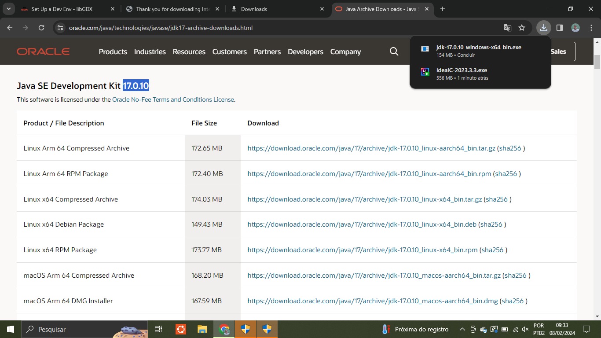
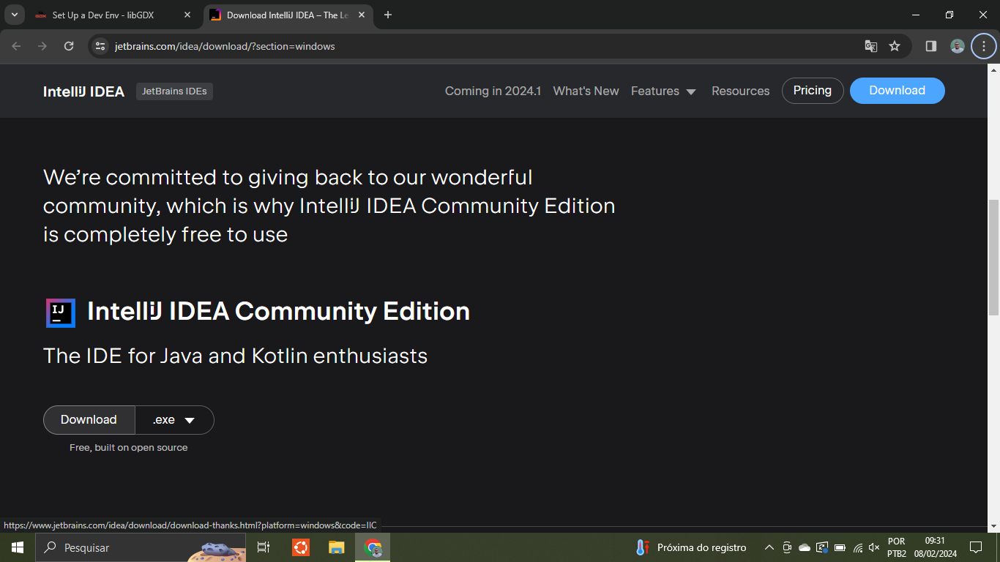
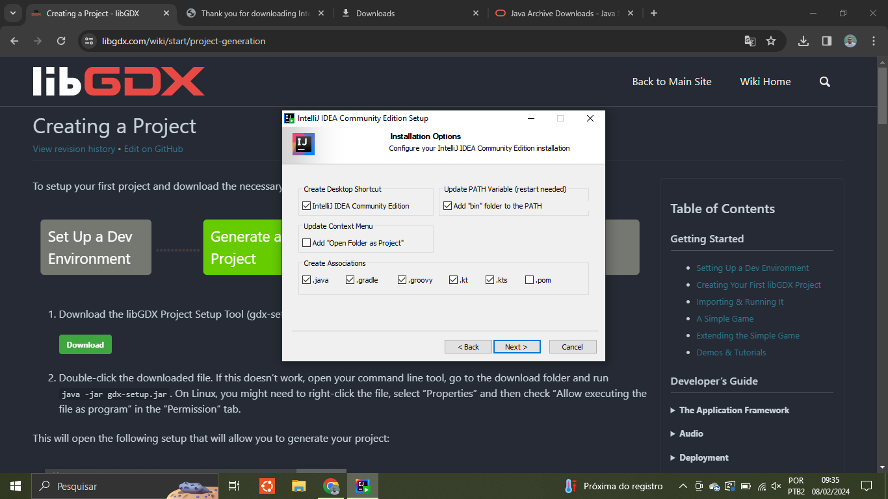
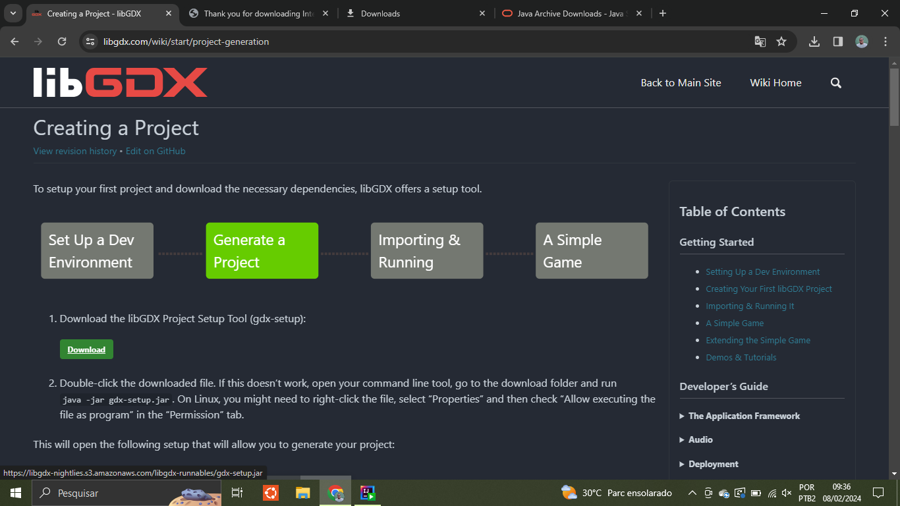
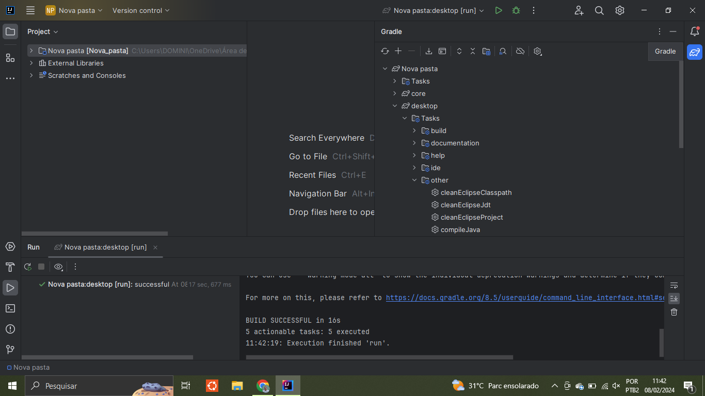

## Dicas de acesso

### instalar java 17

### instalar intellij idea community - versão free

### baixar libgdx caso queira criar um novo projeto

### para rodar o jogo importe o projeto abrindo a pasta do Game Server, abrir arquivo desktopLauncher em desktop e apertar no play, ou entãoclickar em gradle no lado direito, abrir a pasta->desktop->tasks->other-> clickar duas vezes em 'run'.

Fazer o mesmo para cada a pasta Game Client

tutorial do libgdx com explicação do código do jogo: https://libgdx.com/wiki/start/a-simple-game
